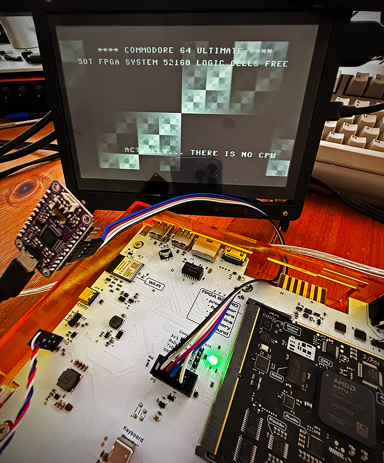

# look ma no vic
## A C64 Ultimate FPGA demo

This is an experimental FPGA demo for the C64 Ultimate.
Hopefully we'll see better demos than this in the future ;-)

# REQUIREMENTS

- A Commodore 64 Ultimate.
- Some way to upload the FPGA bitstream (I use Vivado 2025.2 via JTAG).

# IS THIS SAFE ?

My C64 Ultimate is still working after two days of experiments.  
Use this __at your own risk__.  
Note that [at the moment] __you will have to reinstall the C64U firmware__ after uploading a third-party bitstream like this.   
Also [at the moment] there is no official way to upload third-parties FPGA bitstreams, so I use Vivado 2025.2.  

__IMPORTANT NOTE:__ Power-cycling the C64U after uploading this bitstream will lead to a __seemingly__ bricked machine.  
How to recover:  
- Upload the [C64U firmware](https://github.com/GideonZ/1541ultimate/blob/master/recovery/u64ii/u64_mk2_artix.bit) via JTAG. This will give you a working C64U environment until power-off.
- Run the C64U updater.
- Your machine should be restored, and now survive power off.

Anyway, the golden rule is: If unsure, __DO NOT__ run this !!!

# HOW TO UPLOAD VIA JTAG

[TBD]

# LICENSE

Creative Commons, CC BY

https://creativecommons.org/licenses/by/4.0/deed.en

Please add a link to this github project.

