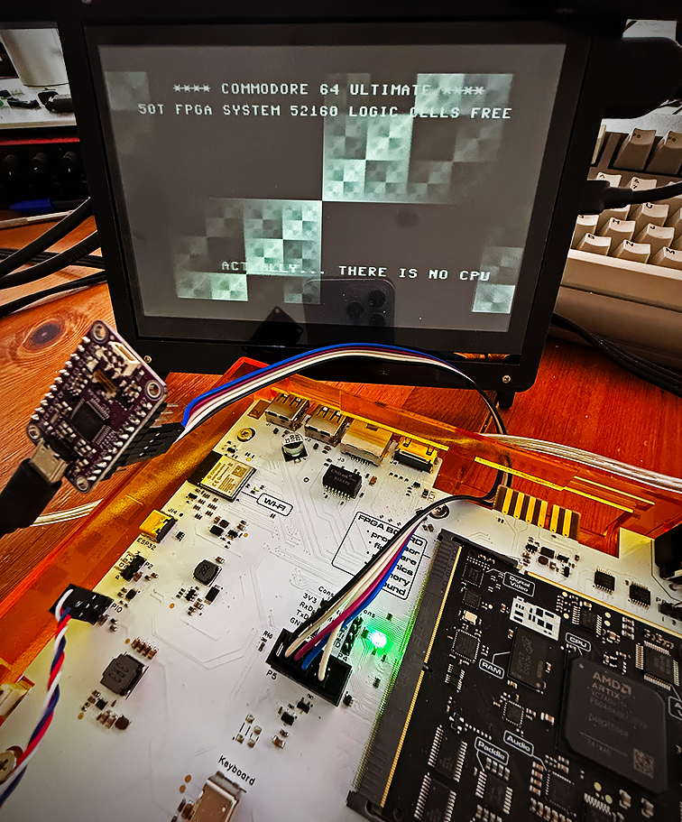
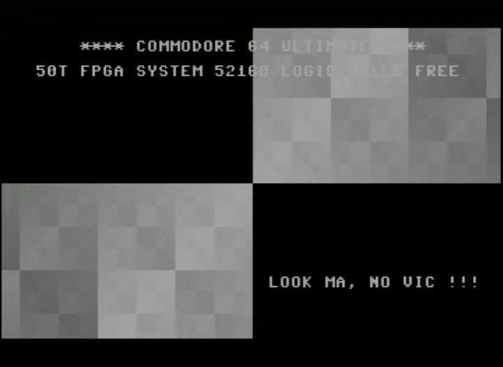
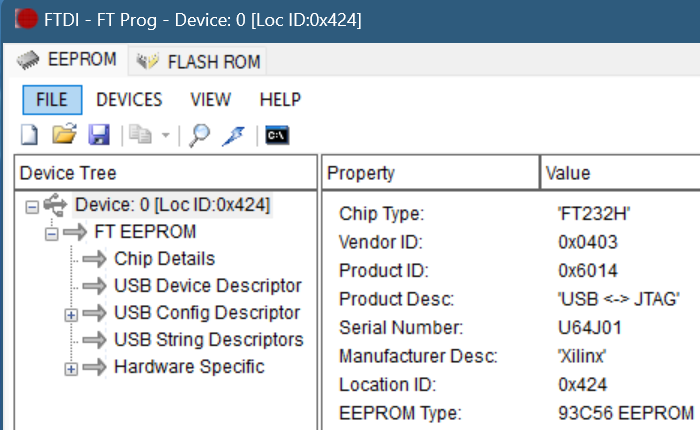
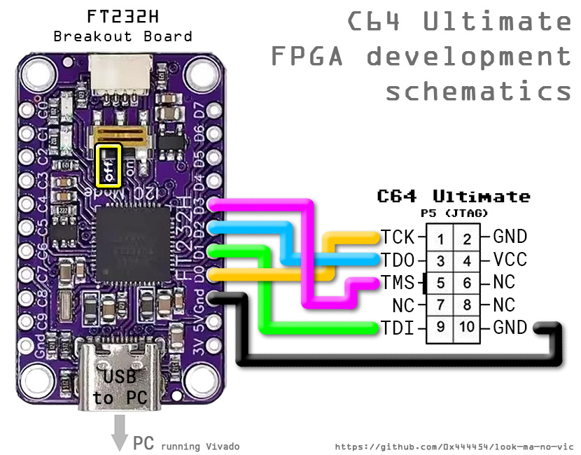
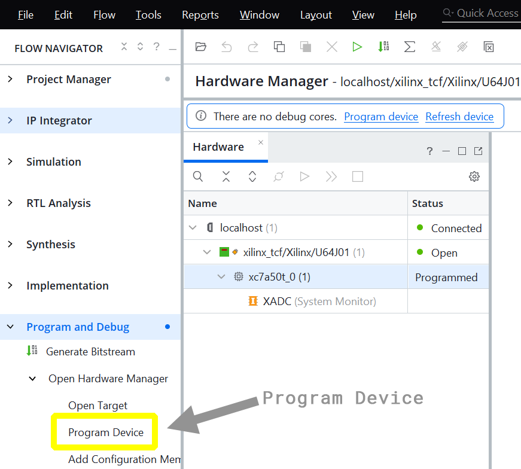

# Look ma, no VIC !
## How to build your own C64 Ultimate FPGA demo

This is an experimental FPGA demo for the C64 Ultimate.  
Hopefully we'll see better demos than this in the future ;-)

## Demo video:  

# REQUIREMENTS

- A Commodore 64 Ultimate.
- Some way to upload the FPGA bitstream (I use Vivado 2025.2 via JTAG).

# IS THIS SAFE ?

Yes, however low level hardware access may cause the machine or peripherals to work in untested or unsupported conditions, especially during "trial and error" experiments.  
Use this code and experiment __at your own risk__.  

Note that [at the moment] there is no official way to upload third-party FPGA bitstreams from the C64U interface, so I use Vivado 2025.2.  

__IMPORTANT NOTE:__ Upload your bitstream directly to the FPGA, so Power-cycling the C64U (with JTAG disconnected !) will be enough to resume normal operation.  
Do __not__ upload to flash or other persistent storage.  

See also [HOW TO RECOVER](#HOW-TO-RECOVER-IN-CASE-OF-PROBLEMS) in case of problems.

Anyway, the golden rule is: If you are not sure what you are doing, __DO NOT__ do it !!! :-)

# HOW TO UPLOAD VIA JTAG

- Get a FT232H breakout board (a USB-C model costs about $15).
- You may need to flash the FT232H board to make Vivado recognize it. Download [FT_Prog](https://ftdichip.com/utilities/) utility from the FTDI web site. Set manufacturer string as "Xilinx" and flash the board (see example screenshot).
 
  

- If the FT232H board has a "I2C" switch, set it to OFF.
- Check schematics for wiring.

- Install AMD [Vivado](https://www.xilinx.com/support/download/index.html/content/xilinx/en/downloadNav/vivado-design-tools.html) 2025.2 or more recent version. It's free and no paid license is needed for this FPGA model.
- Run Vivado and set up a new project. Select "xc7a50tfgg484-1" as FPGA part number.
- Use this [constraints file](https://github.com/GideonZ/1541ultimate/issues/615). [Thanks Gideon !]
- In Vivado, go to "Program and Debug" -> "Open Hardware Manager" -> "Open Target" -> "Auto Connect". If you only see a "localhost" entry in the Hardware Manager window, then your FT232H board has not been recognized. Use FT_Prog to flash your board as described above. If your board is recognized, you will see a "xilinx_[...]" entry under "localhost".
- If your C64 Ultimate is powered on, you should see also a "xc7a50t_0" entry in Vivado Hardware Manager. If you don't, try "Open Target" again.
- Vivado should now show the Program and Debug" -> "Open Hardware Manager" ->"Program Device" option. Use this to upload your bitstream.

# HOW TO RESUME C64U NORMAL OPERATION

FPGA has volatile memory, so your code won't survive a reboot.

- Power the C64U off (you may have to keep the power button pressed down for a few seconds).
- __Disconnect the JTAG interface__ (or just its USB cable, so the FT232H is powered off). If JTAG interface is still enabled, then the C64U will not reprogram the FPGA when powered on, it will not even turn on any LED, and may appear "bricked". Do not panic, take a deep breath, DISCONNECT THE JTAG interface, and power-cycle the machine. ;-)
- Power the C64U on.
- Your C64U should now work as usual.

# HOW TO RECOVER IN CASE OF PROBLEMS

If your C64U appears "bricked", it is probably because it is still in JTAG debug mode (JTAG interface connected and active).  
The C64U will not properly reprogram the FPGA at power-on if the JTAG interface is still active.  Disconnect JTAG cable, or power off the FT232 board (i.e. disconnect its USB cable).  
This hould be enough to resume normal operation.  

In any case, here is how to recover the C64U in case you have issues:  
- Upload the [C64U firmware](https://github.com/GideonZ/1541ultimate/blob/master/recovery/u64ii/u64_mk2_artix.bit) via JTAG. This will give you a working C64U environment.
- Run the C64U updater to restore/update the firmware.
- Your machine should be restored, and now survive power off. Make sure JTAG interface is disconnected or powered off.  

# LICENSE

Creative Commons, CC BY

https://creativecommons.org/licenses/by/4.0/deed.en

Please add a link to this github project.

